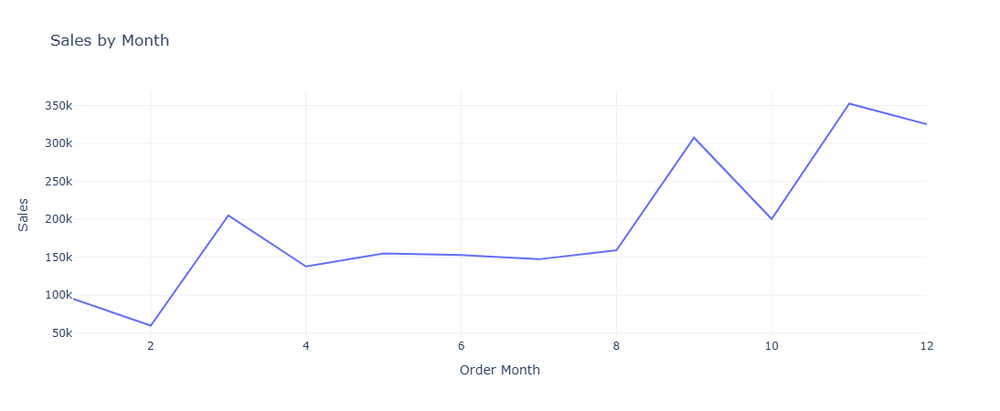
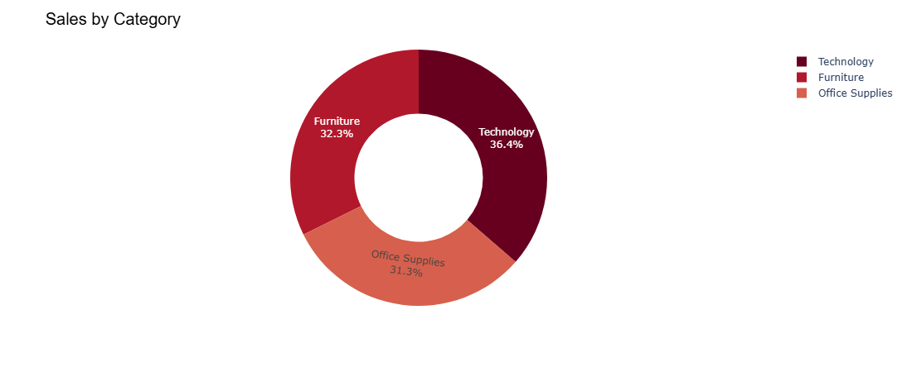
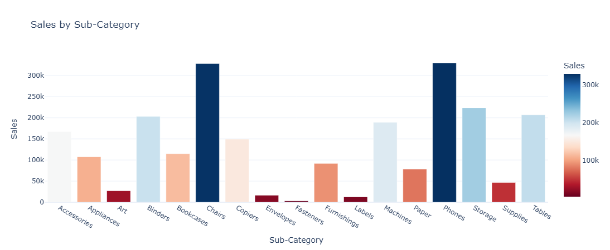
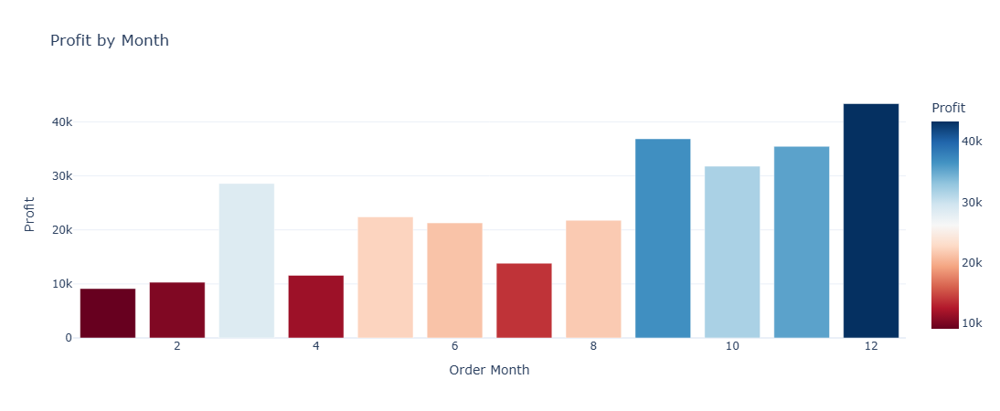
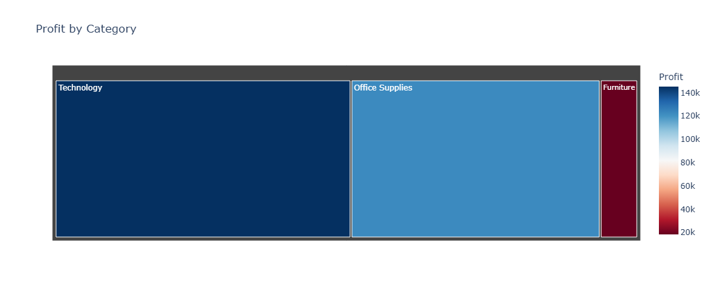
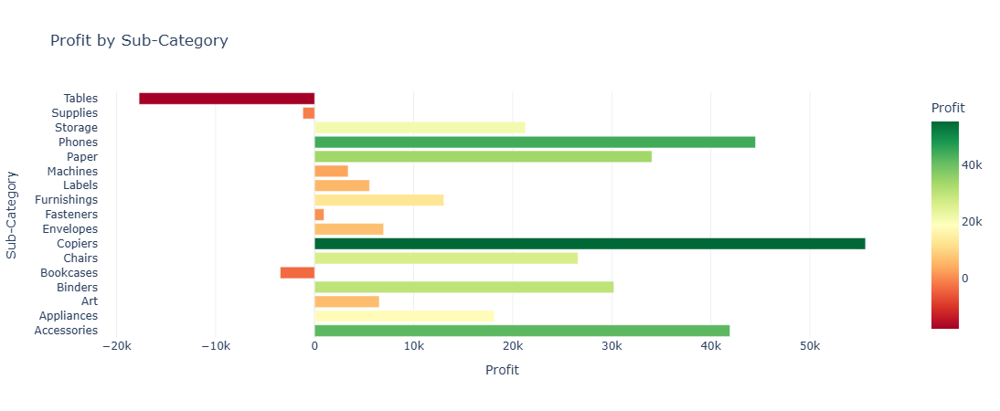
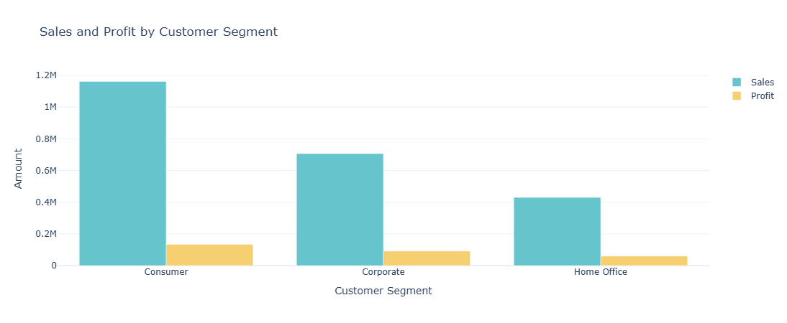

# 📊 E-Commerce Sales Analysis

An end-to-end **Exploratory Data Analysis (EDA)** project on the **Sample Superstore Dataset** using **Python**. This project analyzes sales and profit trends, customer segments, and product categories to generate meaningful business insights through interactive visualizations.

---

# 🛠️ Technologies Used

  
  
  
  
  
  

---

# 📌 Project Overview

This project performs Exploratory Data Analysis (EDA) on the Sample Superstore Dataset using Python. The analysis focuses on understanding sales performance, profit trends, customer segments, and product categories through data cleaning, data processing, and interactive visualizations.

---

# 🎯 Objectives

- Analyze monthly sales trends.
- Identify the highest and lowest sales months.
- Compare sales across different categories.
- Analyze sub-category performance.
- Evaluate monthly profit trends.
- Compare profit by category and sub-category.
- Analyze customer segment performance.
- Calculate the Sales-to-Profit Ratio.

---

# 📂 Dataset

**Dataset:** Sample - Superstore.csv

The dataset includes:

- Customer Orders
- Product Categories
- Sub-Categories
- Customer Segments
- Sales
- Profit
- Shipping Details

---

# 📈 Analysis Performed

- Monthly Sales Analysis
- Category-wise Sales Analysis
- Sub-Category-wise Sales Analysis
- Monthly Profit Analysis
- Profit by Category
- Profit by Sub-Category
- Sales & Profit by Customer Segment
- Sales-to-Profit Ratio Analysis

---

# 📊 Visualizations

The project includes:

- 📈 Line Chart
- 📊 Bar Chart
- 🥧 Pie Chart
- 🌳 Treemap
- 📉 Horizontal Bar Chart

---
## 📊 Project Visualizations

### 1. Monthly Sales Analysis

### 2. Category-wise Sales Analysis

### 3. Sub-Category Sales Analysis

### 4. Monthly Profit Analysis

### 5. Profit by Category

### 6. Profit by Sub-Category

### 7. Sales & Profit by Customer Segment

# 🔍 Key Insights

- Monthly sales and profit trends were analyzed.
- Category-wise and sub-category-wise performance was compared.
- Customer segment contribution to sales and profit was evaluated.
- Sales-to-Profit Ratio was calculated to measure business performance.
- Interactive visualizations helped identify high-performing and low-performing business areas.

---

# ✅ Conclusion

This project demonstrates how Exploratory Data Analysis (EDA) can transform raw business data into meaningful insights. The analysis helps understand sales trends, profitability, customer behavior, and overall business performance, supporting better data-driven decision-making.

---

## 📂 Project Structure

E-Commerce-Sales-Analysis/
│── E-commerce_sales.ipynb
│── README.md
│── Sample - Superstore.csv
└── Images/
    │── Monthly_sales.png
    │── Category_sales.png
    │── SubCategory_sales.png
    │── Monthly_profit.png
    │── Profit_by_category.png
    │── Profit_by_subcategory.png
    └── Sales-and-Profit_by_Customer_segment.png

---

# 👨‍💻 Author

**Shreyansh Srivastava**